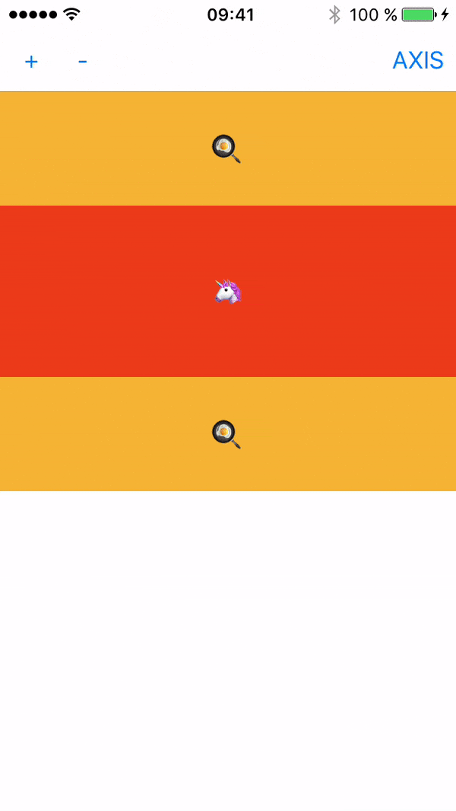

# LDStackScrollView

[](http://cocoapods.org/pods/LDStackScrollView)
[](http://cocoapods.org/pods/LDStackScrollView)
[](http://cocoapods.org/pods/LDStackScrollView)

A simple UIView with a UIStackView embed in a UIScrollView .Bored by do this architecture on every project I made my own quick library for all my projects. Feel free to improve.


## Example

To run the example project, clone the repo, and run `pod install` from the LDStackScrollViewSample directory first.

## Requirements

- `iOS 9` minimum (due to UIStackView)

## Installation

LDStackScrollView is available through [CocoaPods](http://cocoapods.org). To install
it, simply add the following line to your Podfile:

```ruby
pod "LDStackScrollView"
```

## Demo



## Author

Léo Derbois, developer@leoderbois.com

## License

LDStackScrollView is available under the MIT license. See the LICENSE file for more info.
